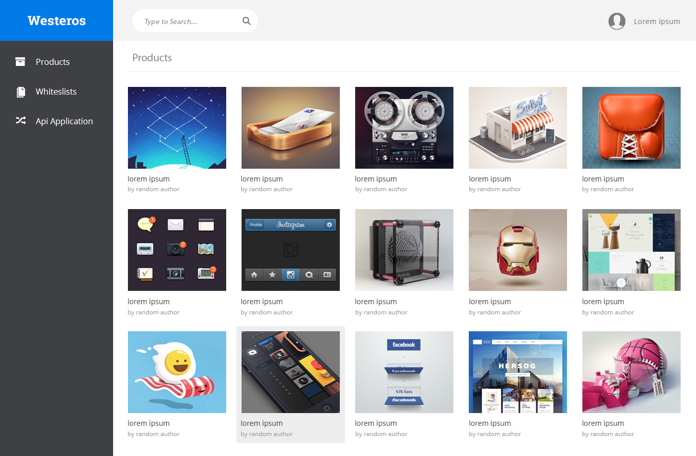

# Test task one
*It was implemented in Feb, 2016. I've made it public here just in case if other front-end developers can find some relevant information for similar tasks. For example, how to structure their test tasks or what kind of tools can be useful while coding.*

A mock-up that needs to be implemented into html/css/js.

## Implementation 
1. Extract product pictures using a design app (Photoshop, Sketch)
2. Use an icon font for icons ([Font Awesome](http://fontawesome.io/), [Ionicons](http://ionicons.com/))
3. To automate some repetitive tasks (minification, concatenation, linting, optimization or any others), use a build system. I used [gulp.js](https://gulpjs.com/)
4. A package manager helps you to use gulp.js and all required dependences. The quite common JavaScript package manager is [npm](https://www.npmjs.com/) 
5. I didn't want to repeat the same html for every product image (there are 15 of them on the page). Using a templating language can be a good solution in this case. I chose [Nunjucks](https://mozilla.github.io/nunjucks/)
6. All source files such as templates, scss files and non-minified JavaScript files you will find in `src` folder

It's time to build a project! Run the following commands in Terminal (don't forget to be in the project folder).
* `npm install`
* `gulp build`

Congratulations! You've just compiled the project and have it in `build` folder.
